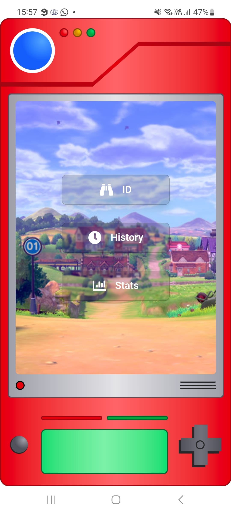
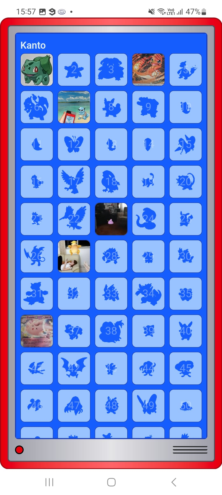
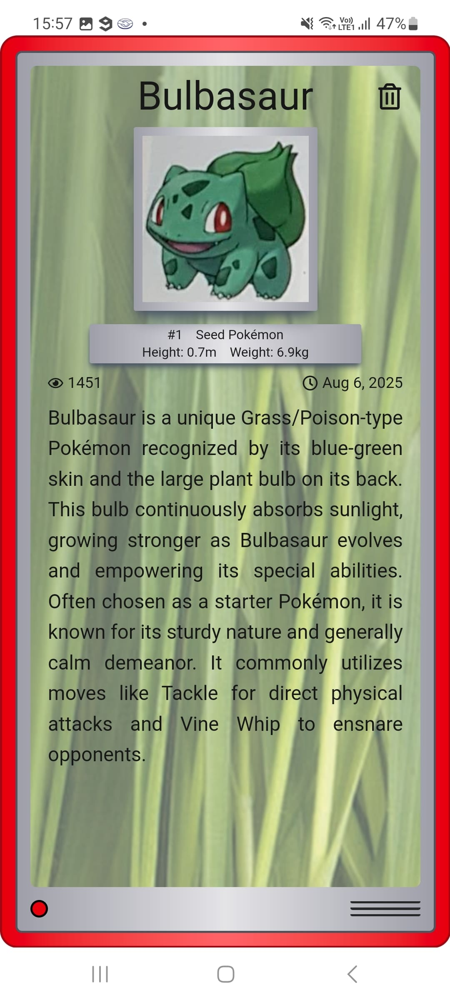
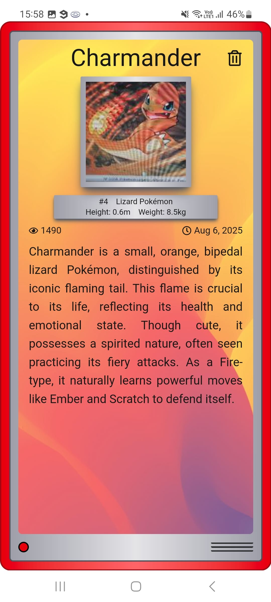
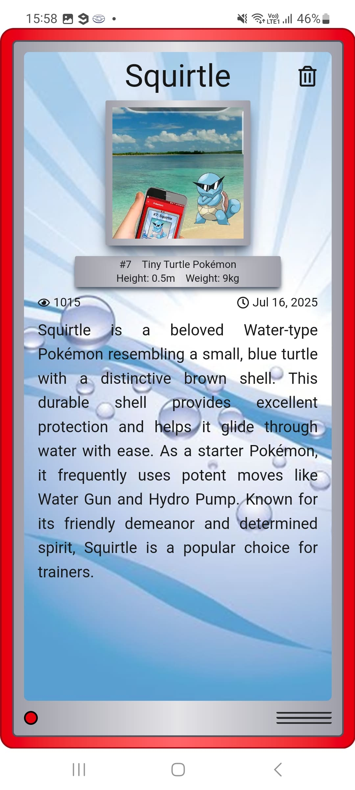

# pokedex-ar-web

Status: 🚧 Em construção 🚧

## 🚀 Projeto
Um identificador de imagens de Pokemon! Tire uma foto e descubra mais sobre seu Pokemon preferido!
  
Depois do sucesso de [Pokedex AR](https://github.com/Alessandro1918/pokedex-ar), app disponível na Google Play entre 2019 e 2022, com mais de **100 mil downloads** ao redor do mundo, trazemos agora a versão web!
  
Confira online em: [https://pokedex-ar-web.vercel.app](https://pokedex-ar-web.vercel.app)

  
  

  
  
  

## 🧊 Cool features
- Fotos dos Pokemons reconhecidos salvas localmente;
- Tela de identificação personalizada;
- Contagem mundial de Pokemons reconhecidos, divido por espécie e região;

## ⭐ Like, Subscribe, Follow!
Curtiu o projeto? Marque esse repositório com uma Estrela ⭐!
